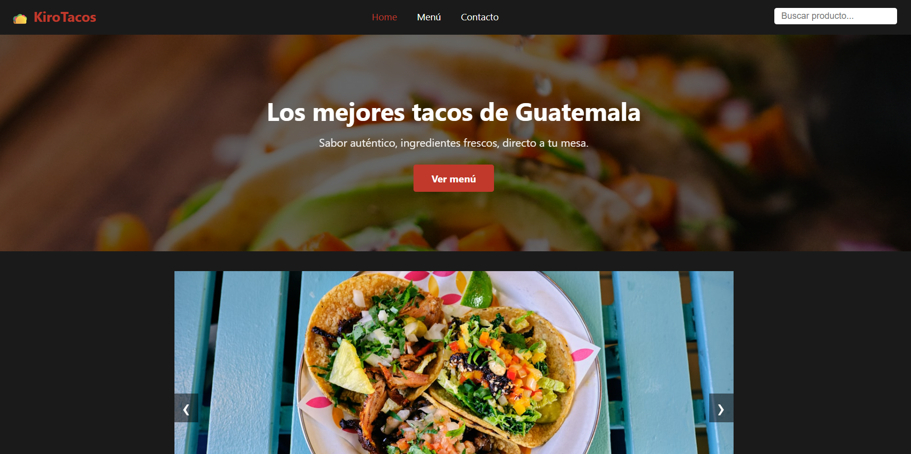
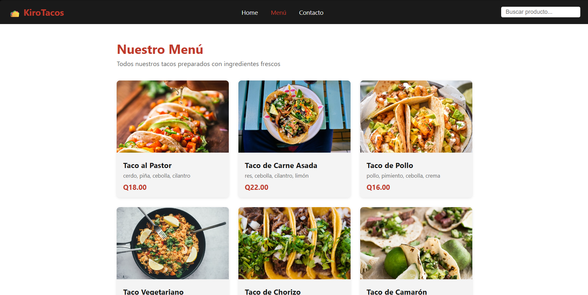
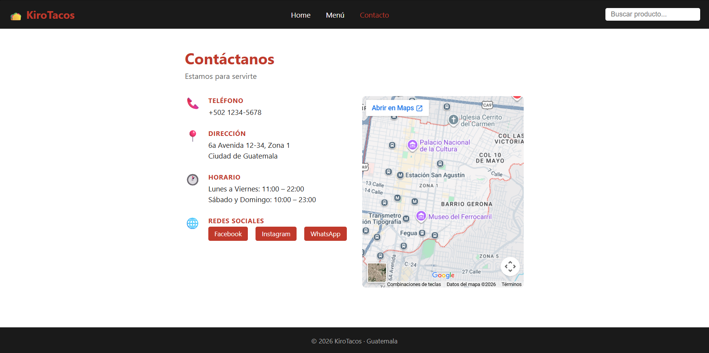

# KiroTacos

Sitio web informativo para una taquería guatemalteca. Muestra el menú, información de contacto y productos destacados.

## Sitio desplegado con github pages
https://stan-2021131.github.io/KiroTacos/

## Evidencia
### Home


### Menú


### Contactos


## Spec-Driven Development

Este proyecto fue desarrollado utilizando un enfoque spec-driven.

### Flujo seguido:
1. requirements.md → definición de funcionalidades
2. design.md → arquitectura y estructura del proyecto
3. tasks.md → división en tareas pequeñas
4. implementación iterativa usando CLI agent

## Estructura

```
KiroTacos/
├── index.html        # Home: hero, carrusel y productos destacados
├── menu.html         # Menú completo con buscador en tiempo real
├── contact.html      # Teléfono, dirección, horario, redes y mapa
├── css/
│   ├── styles.css    # Reset, variables, estilos globales y sticky footer
│   ├── navbar.css    # Navbar responsive con hamburguesa
│   ├── home.css      # Hero, carrusel y sección de destacados
│   ├── menu.css      # Grid de productos del menú
│   └── contact.css   # Layout de información y mapa
└── js/
    ├── products.js   # Array de productos + función renderCards()
    ├── carousel.js   # Lógica del carrusel (dots, prev/next, auto-avance)
    └── search.js     # Buscador en tiempo real (filtra en menú, redirige desde otras páginas)
```

## Tecnologías

- HTML5 semántico
- CSS3 (Flexbox, Grid, variables CSS, media queries)
- JavaScript vanilla

Sin frameworks, sin dependencias, sin base de datos.

## Productos

Los productos se definen en `js/products.js` como un array de objetos:

```js
{
  id: 1,
  nombre: 'Taco al Pastor',
  ingredientes: ['cerdo', 'piña', 'cebolla', 'cilantro'],
  precio: 18.00,          // en quetzales
  imagen: 'url...',
  destacado: true         // aparece en home si es true
}
```

Para agregar o editar productos, modificar únicamente ese archivo.

## Buscador

- Disponible en el navbar de todas las páginas.
- En `menu.html`: filtra las cards en tiempo real por nombre.
- En otras páginas: al presionar Enter redirige a `menu.html?q=término`.

## Responsive

| Breakpoint | Comportamiento |
|---|---|
| > 900px | Menú en 3 columnas, navbar horizontal |
| ≤ 900px | Menú en 2 columnas |
| ≤ 768px | Navbar colapsa a hamburguesa |
| ≤ 560px | Menú en 1 columna |

## Uso

Abrir `index.html` directamente en el navegador. No requiere servidor.
